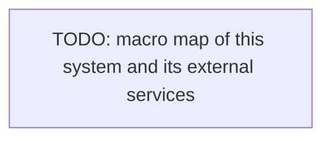

# Integration

How this system integrates with external/third-party services.

## External services

- <Each external service (payments, email, storage), its purpose, integration point>

<!--
Capture: the external integrations and the macro map to them.
Skip: internal module flow (that lives in architecture). Keep the diagram macro. Remove this comment when filled.
-->
