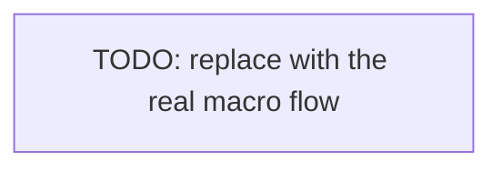

# Architecture

The macro technical shape: the stack, how the pieces fit, and the decisions behind them. Point to the code, do not restate it.

## Stack

- <Language and runtime, the main framework, the one-line why>
- <Cross-cutting libraries only; a capability's own library (ORM, test runner) lives in its file>

## How it fits together

The macro flow between the main parts. One box per area, high level only.

## Key decisions

- <A decision not obvious from the code, and its reason>
- <A constraint or trade-off a contributor must respect>

## Gotchas

- <Something surprising that bites newcomers>

<!--
Capture: the stack, the macro structure, the non-obvious decisions and gotchas.
Skip: the full file tree, exhaustive dependency lists, anything re-derivable by scanning the repo.
Keep the diagram macro and follow the project's Mermaid conventions. Remove this comment when filled.
-->
