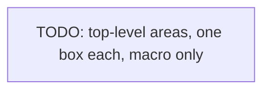

# Codebase Map

The macro layout: the top-level areas and what each holds. A map to navigate, not the full tree.

## Areas

- `<dir>`: <what lives here, its responsibility>
- `<dir>`: <...>

## Entry points

- <Where execution starts, the main file(s)>

## Packages

- <Each workspace package and its role. Drop this section if not a monorepo>

<!--
Capture: the few top-level areas, the entry points, and (if a monorepo) the package map.
Skip: the full file tree, every subfolder. Point, do not enumerate.
Keep the diagram macro and follow the project's Mermaid conventions. Remove this comment when filled.
-->
