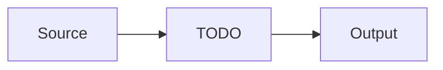

# Data

The data and ML side: sources, pipelines, and models.

## Sources

- <The datasets and where they come from>

## Pipeline

The processing stages from raw to output.

## Models

- <The models or experiments, where they are tracked>

## Reproducibility

- <Data and experiment versioning (DVC, MLflow), how a run is reproduced>

<!--
Capture: the sources, the macro pipeline, the models and reproducibility.
Skip: per-column schemas. Keep the diagram macro. Remove this comment when filled.
-->
