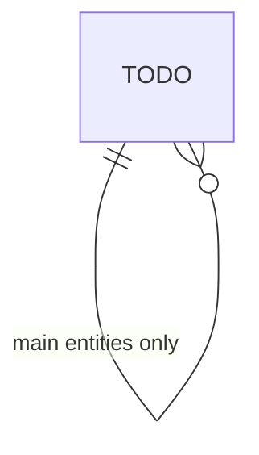

# Database

The data store: its type, the main entities, and the conventions. The macro model, not the full schema.

## Setup

- <Database type, ORM or driver, where the config lives>

## Main entities

The core entities and their relationships, high level only.

## Conventions

- <Migration tool and flow, seeding, naming>
- <Point to the auto-generated schema>

<!--
Capture: the DB choice, the macro entity model, the migration and seed conventions.
Skip: the full schema, every column. Point to the schema file. Remove this comment when filled.
-->
