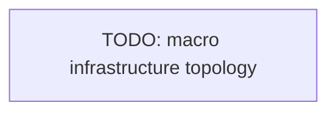

# Infrastructure

How the runtime is provisioned: infrastructure as code and topology.

## Tooling

- <IaC tool (Terraform, Pulumi, Helm), where the definitions live>

## Topology

The main resources (compute, network, storage) and how they connect.

## Conventions

- <How changes are applied, state management, environments>

<!--
Capture: the IaC tool, the macro topology, the apply flow.
Skip: every resource. Keep the diagram macro. Remove this comment when filled.
-->
