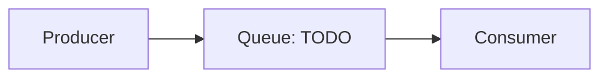

# Messaging

How the system handles asynchronous work: queues and events.

## Broker

- <The queue or broker, where producers and consumers live>

## Topics

- <The main queues or topics and what each carries>

## Conventions

- <Retry, dead-letter, ordering, idempotency>

<!--
Capture: the broker, the topics, the delivery conventions.
Skip: every message shape. Keep the diagram macro. Remove this comment when filled.
-->
