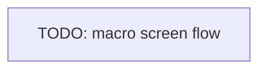

# Mobile

The mobile app: platform, navigation, native access, and release.

## Platform

- <iOS, Android, or cross-platform (React Native, Flutter), the framework>

## Navigation

The macro screen flow.

## Native access

- <Device APIs used (camera, GPS, push) and the permissions required>

## State and storage

- <State management, offline and local storage>

## Build and release

- <Build tooling, code signing, the app stores, OTA updates>

<!--
Capture: the platform, navigation, native access, and release flow.
Skip: per-screen detail. Keep the diagram macro. Remove this comment when filled.
-->
