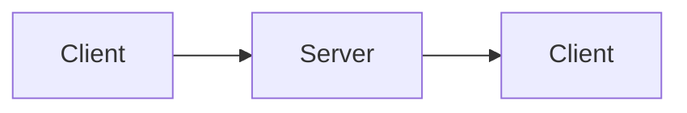

# Realtime

How the project pushes live updates: the transport and the channels.

## Transport

- <WebSocket, SSE, or polling, the library, where the server lives>

## Channels

- <The main channels or topics and what flows on each>

## Conventions

- <Auth on the socket, reconnection, presence>

<!--
Capture: the transport, the channels, the conventions.
Skip: every event. Keep the diagram macro. Remove this comment when filled.
-->
