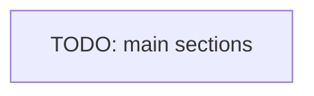

# Navigation

How the user moves through the app: routing and the page structure.

## Routing

- <Client routing: the router and where client routes are defined>
- <Public versus protected route handling>

## Structure

The macro page map, main sections only.

<!--
Capture: the routing approach and the macro page map.
Skip: every route. Keep the diagram macro. Remove this comment when filled.
-->
