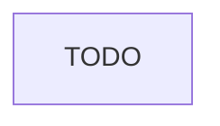

<!-- Fill or omit these sections; never add, rename, or reorder one. -->

# Instruction: {title}

## Architecture projection

> Tree of the final files. ✅ create · ✏️ modify · ❌ delete

```txt
.
```

## User Journey



## Wireframe

<!-- UI phase only. No UI => omit the section, don't invent one. -->

```txt
{the confirmed wireframe}
```

## Tasks to do

### `{number})` {name}

> {straight to point goal}

1. {ultra concise step}
   ...

## Test acceptance criteria

<!-- Each criterion is an observable behavior, not a command. -->

| Task | Acceptance criteria              |
| ---- | -------------------------------- |
| 1... | {observable behavior of the task} |
