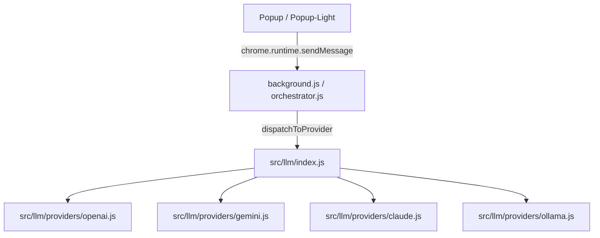
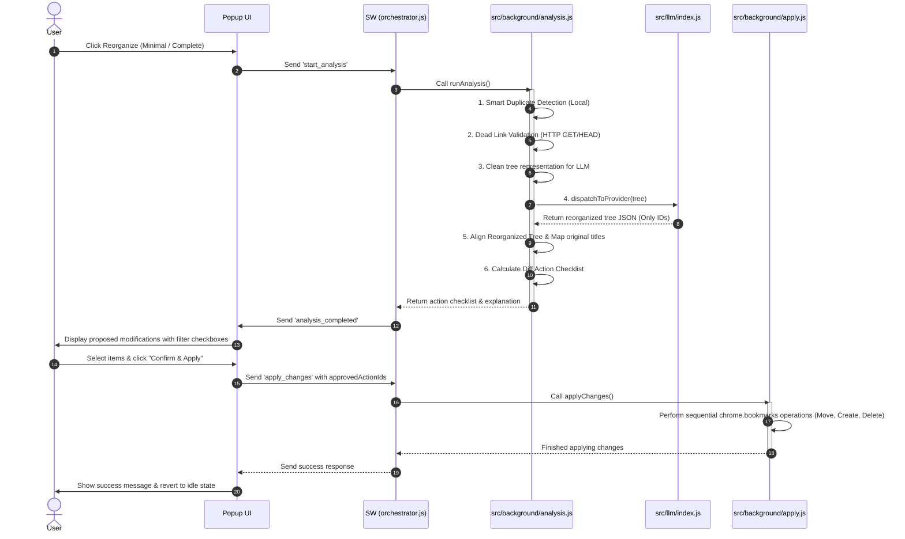

# Developer and AI Agent Guide

This guide details the architecture of FavorAI to help developers and other agentic coding systems understand and modify the extension safely and efficiently.

---

## 📂 Project Architecture & File Structure

We follow a strict **Separation of Concerns** to isolate UI logic, background orchestration, and target API clients:

```
FavorAI/
├── manifest.json                    # Extension metadata, permissions & service worker declaration
├── background.js                    # Service Worker entrypoint (loads background/orchestrator.js)
├── popup.html                       # Full popup UI layout (localized via data-i18n attributes)
├── popup-light.html                 # Lightweight popup variant for the browser action quick access
├── popup.css                        # UI styling rules (shared by both popup variants)
├── popup.js                         # Main UI entrypoint (boots modular UI components from src/popup/)
├── popup-light.js                   # Simplified UI logic for the lightweight popup variant
├── Makefile                         # Unified interface for linting, testing, and packaging
├── scripts/
│   ├── security-check.js            # Unified security audit (npm audit + ESLint + web-ext lint + Gitleaks secret scanning)
│   ├── bump-version.js              # SemVer bump, CHANGELOG generation, commit & tag automation
│   ├── release.js                   # GitHub Release publisher (extracts notes & appends compare link)
│   ├── package.js                   # Extension ZIP packaging for the Chrome Web Store
│   ├── publish.mjs                  # Chrome Web Store upload & publish via OAuth2
│   └── get-refresh-token.mjs        # One-time OAuth2 refresh token helper
├── src/
│   ├── background/
│   │   ├── orchestrator.js          # Service worker state, event router, keep-alive alarm listener
│   │   ├── analysis.js              # Runs duplicate detections, dead-link checks, orchestrates LLM call
│   │   ├── diff.js                  # Aligns reorganized LLM outputs and builds node mappings
│   │   ├── apply.js                 # Safe updates, parent ID resolutions, deletions, and moves
│   │   └── history.js              # History tracking and bookmarks rollback mechanics
│   ├── llm/
│   │   ├── index.js                 # Unified LLM query routing via dispatchToProvider()
│   │   ├── prompts.js               # System and user prompt templates (PROMPT_COMPLETE, PROMPT_MINIMAL, PROMPT_SUGGEST)
│   │   ├── utils.js                 # LLM response parser, JSON sanitation, and fetch timeout helpers
│   │   └── providers/               # API client wrappers: openai, gemini, claude, mistral, deepseek, ollama, grok, custom
│   ├── popup/                       # Modular popup UI submodules
│   │   ├── config.js                # API models fetching, configuration state sync, form listeners
│   │   ├── history.js               # Reorg history logging UI, rollback, and deletion
│   │   ├── navigation.js            # Tab switching, main/validation view toggling
│   │   ├── reorg.js                 # Progress bars, folder selection, launch workflow, inline modification edit panel
│   │   └── utils.js                 # UI helpers: toast, confirm modals, logging helpers, formatting
│   └── utils/
│       ├── constants.js             # Shared static constraints and browser structural root IDs
│       ├── escapeHtml.js            # XSS HTML escaper helper
│       ├── isSafeUrl.js             # Scheme validation (http/https only — rejects javascript:, data:, etc.)
│       └── truncateString.js        # String truncation helper with ellipsis
```

---

## 🧬 Data Schemas & LLM Contracts

To maintain state integrity, AI agents must respect the exact schemas used for LLM payload exchanges:

### 1. Simplified Input Tree (Sent to LLM)

The tree is sent to the external LLM provider with URLs included to aid semantic classification. Duplicates and dead links already handled locally are excluded before sending.

```json
{
  "id": "1",
  "title": "Barre de favoris",
  "children": [
    { "id": "10", "title": "GitHub repository", "url": "https://github.com" },
    {
      "id": "2",
      "title": "Design resources",
      "children": [
        { "id": "11", "title": "CSS Gradients guide", "url": "https://css-tricks.com" }
      ]
    }
  ]
}
```

### 2. Reorganized Tree Output (Received from LLM)
The LLM response must be a valid JSON object containing a `reorganizedTree` and an `explanation`.
* **Important**: Bookmarks should only contain the `id` field. Titles/URLs are automatically restored on the client side using `restoreOriginalMetadata`.
* **Important**: New folders created by the LLM must use the prefix `new_` (e.g., `new_dev_tools`).
```json
{
  "reorganizedTree": {
    "id": "1",
    "title": "Barre de favoris",
    "children": [
      {
        "id": "new_dev_tools",
        "title": "Developer Tools",
        "children": [
          { "id": "10" }
        ]
      },
      {
        "id": "new_learning",
        "title": "Learning",
        "children": [
          { "id": "11" }
        ]
      }
    ]
  },
  "explanation": "Here is a brief description of the changes made..."
}
```

---

## 🗺️ LLM Providers Architecture & System Flows

### 1. LLM Providers Dispatch Architecture
The LLM integration is modularized to support multiple AI backends seamlessly. The entry point is [src/llm/index.js](file:///d:/Travail/Projet/favorai-chrome/src/llm/index.js), which exposes:
* `dispatchToProvider(config, systemPrompt, userPrompt, signal)`: Centralized router that maps the configured `provider` string to the correct provider wrapper.

Each provider is implemented as a standalone module inside `src/llm/providers/`:
* [openai.js](file:///d:/Travail/Projet/favorai-chrome/src/llm/providers/openai.js): Integrates with standard OpenAI models and supports custom endpoints.
* [gemini.js](file:///d:/Travail/Projet/favorai-chrome/src/llm/providers/gemini.js): Wraps Google's Gemini API via its native JSON format.
* [claude.js](file:///d:/Travail/Projet/favorai-chrome/src/llm/providers/claude.js): Wraps Anthropic's Claude API.
* Other platforms ([mistral.js](file:///d:/Travail/Projet/favorai-chrome/src/llm/providers/mistral.js), [deepseek.js](file:///d:/Travail/Projet/favorai-chrome/src/llm/providers/deepseek.js), [ollama.js](file:///d:/Travail/Projet/favorai-chrome/src/llm/providers/ollama.js)): Specialized wrappers tailored to each platform's distinct API structures.



### 2. Bookmark Reorganization Sequence Flow
The following flow diagram shows the complete sequence of actions from launching the reorganization to validating and applying modifications:



---

## 🧪 Testing & Mocking Architecture

### 1. Mocking Chrome APIs
When writing unit tests under `tests/unit/`, do not invoke real browser APIs. A global mock system is pre-configured in [tests/setup.js](tests/setup.js) using the mocks defined in [tests/mocks/chrome.js](tests/mocks/chrome.js).
Ensure you mock return values explicitly inside your test cases when test targets make Chrome API calls:
```javascript
chrome.bookmarks.getTree.mockResolvedValue([{ id: '0', title: 'Root', children: [] }]);
```

### 2. Available Make Commands

**CRITICAL: Always run lint and unit tests before committing. Run e2e tests for UI/integration changes.**

| Command | Description |
|---|---|
| `make lint` | ESLint — validates **all** JS files (src/, popup*.js, scripts/, tests/, config). **Run first.** |
| `make lint-fix` | ESLint auto-fix |
| `make test` | Vitest unit tests (172 tests, 100% coverage). **Run after lint.** |
| `make test-watch` | Vitest in interactive watch mode |
| `make test-coverage` | Unit tests + formatted global coverage summary |
| `make test-e2e` | Playwright e2e tests (106 tests, UI + integration). Runs `clean-e2e` first. |
| `make test-e2e-ui` | UI e2e tests only |
| `make test-e2e-integration` | Integration e2e tests only |
| `make bump` | Auto-detect SemVer bump type (major/minor/patch) from git history & update CHANGELOG |
| `make bump-patch` | Increment patch version (e.g. 1.2.0 -> 1.2.1) manually |
| `make bump-minor` | Increment minor version (e.g. 1.2.0 -> 1.3.0) manually |
| `make bump-major` | Increment major version (e.g. 1.2.0 -> 2.0.0) manually |
| `make release` | Package extension, push commits/tags, and create/update GitHub release (with changelog extraction & comparison links) |
| `make clean` | Remove coverage/, playwright-report/, test-results/, dist/, *.zip |
| `make clean-e2e` | Remove leftover Playwright Chrome tmp dirs and test reports |
| `make kill-e2e` | Kill any orphaned Playwright-spawned Chrome processes |
| `make package` | Package the extension into a ZIP for the Chrome Web Store |
| `make screenshots` | Generate all store asset PNGs from HTML sources |
| `make upload` | Build ZIP + upload to Chrome Web Store as draft (no publish) |
| `make publish` | Build ZIP + upload + publish to all users |
| `make publish-testers` | Build ZIP + upload + publish to trusted testers only |
| `make security` | Unified security audit: npm audit + ESLint security rules + web-ext lint + Gitleaks secret scanning |

**Recommended workflow before committing:**
```bash
make lint && make test
```

**For UI or integration changes, also run e2e:**
```bash
make lint && make test && make test-e2e
```

### 3. Test Coverage Requirements

**Unit Tests** (172 tests, 100% coverage):
- Located in `tests/unit/`
- Test utility functions, analysis logic, LLM parsing, diff calculations
- Mock Chrome APIs using `tests/mocks/chrome.js`
- **CRITICAL**: The unit test coverage rate MUST always be 100% across all files and columns/types (Statements, Branches, Functions, and Lines). Any modification or new feature must be accompanied by relevant unit tests to maintain this 100% rate.
- **Note on V8 synthetic branches**: The v8 coverage provider generates phantom branches on `import` statements and JSDoc block comments at line 1 of each file. These cannot be covered by user-land tests. Suppress them with `/* v8 ignore next */` placed on its own line immediately before the affected statement. Do not add this comment elsewhere.
- Run with: `make test` or `make test-coverage`

**E2E Tests** (106 tests, 10 spec files):
- Located in `tests/e2e/`
- Shared helpers in `tests/e2e/helpers.js` (`launchExtension`, `gotoPopup`, `cleanup`)
- Configuration: `workers: 2`, `timeout: 60s`, `retries: 1` (see `playwright.config.js`)
- Cover: popup structure, tab navigation, configuration forms, history display, reorganization UI, popup-light interface, i18n, error handling, integration flows
- **Add tests for new features**: When implementing a new feature, add corresponding e2e tests to catch integration errors early
- Run with: `make test-e2e`

**Best Practice: Test-Driven Development**
1. Write e2e test first for new features
2. Implement the feature
3. Run `make lint && make test` — must pass before every commit
4. Run `make test-e2e` for UI/integration changes
5. All tests must pass before committing

### 4. Versioning and Release Workflow

Creating a new release and publishing it to the Chrome Web Store is automated via the `Makefile` and helper scripts.

#### One-Time Setup
Before you can publish to the Chrome Web Store, ensure you have set up your API credentials:
1. Copy `.env.example` to `.env`:
   ```bash
   cp .env.example .env
   ```
2. Fill in the following OAuth2 and store details in `.env`:
   - `WEBSTORE_CLIENT_ID`: OAuth2 client ID from the Google Cloud Console.
   - `WEBSTORE_CLIENT_SECRET`: OAuth2 client secret from Google Cloud.
   - `WEBSTORE_EXTENSION_ID`: The ID of your extension in the Chrome Web Store Developer Dashboard.
3. Obtain a refresh token by running:
   ```bash
   node scripts/get-refresh-token.mjs
   ```
   This will open a browser to authenticate. Authorize the application and copy the resulting code/refresh token back into your `.env` file as `WEBSTORE_REFRESH_TOKEN`.

#### Release Checklist & Process
Whenever you are ready to publish a new version:

1. **Verify Codebase Integrity & Security**: Ensure all tests, lint checks, and security audits pass cleanly:
   ```bash
   make lint && make test && make test-e2e && make security
   ```
2. **Synchronize Versions, update CHANGELOG, commit, and tag**: Bump the version across files, prepend release notes to `CHANGELOG.md`, and automatically stage, commit, and tag the release version locally. If the GitHub CLI (`gh`) is logged in, it will also push to GitHub and create/update the corresponding GitHub Release with parsed release notes and comparison links:
   - **Auto-detected Release** (SemVer based on git commits since the last tag): `make bump`
   - **Patch Release** (force e.g., 1.2.0 ➔ 1.2.1): `make bump-patch`
   - **Minor Release** (force e.g., 1.2.0 ➔ 1.3.0): `make bump-minor`
   - **Major Release** (force e.g., 1.2.0 ➔ 2.0.0): `make bump-major`
   - **Recreate/Publish GitHub Release manually**: `make release` (runs `scripts/release.js` to extract current version notes from `CHANGELOG.md` and update/create the GitHub Release)
3. **Generate Store Assets (Optional)**: If UI screenshots or promotional tiles need updating, regenerate them:
   ```bash
   make screenshots
   ```
4. **Publish to Chrome Web Store**: Choose one of the deployment targets:
   - **Full Release**: Upload the packaged ZIP and submit for review/publish to all users:
     ```bash
     make publish
     ```
   - **Tester Release**: Deploy to your group of trusted testers only:
     ```bash
     make publish-testers
     ```
   - **Draft Upload**: Upload the package as a draft without submitting for review:
     ```bash
     make upload
     ```

---

## ⚠️ Common Gotchas & Extension Best Practices

To ensure compliance with Chrome and Edge Manifest V3 stores:

1. **Service Worker State Ephemerality**:
   - Background service workers are terminated after 30 seconds of inactivity.
   - Do **NOT** store state in memory variables (e.g., `let activeDiff = {...}`).
   - **Fix**: Persist state to `chrome.storage.local` and retrieve it on event wakes.
   - `popupWindowId` is persisted to `chrome.storage.local` and restored on SW startup.

2. **Sync Storage Write Limits**:
   - `chrome.storage.sync` write quota is limited to 120 writes per minute.
   - Do **NOT** write to `chrome.storage.sync` inside loop routines or rapid status changes. Use `chrome.storage.local` for dynamic logs or cache.

3. **Background Network Calls**:
   - All external fetch operations must run inside the background service worker. If executed inside the popup, the requests will abort when the user closes the popup window.

4. **XSS Security (CSP)**:
   - Remote script downloads or CDN loading is strictly blocked. All code must be local.
   - Avoid using `innerHTML`, `outerHTML`, or `document.write` to bind values. Use `textContent` or construct DOM elements programmatically using `document.createElement()`.

5. **Security & Privacy**:
   - API keys must never be logged, even in debug mode. Use masked values (e.g., `key=***`) in log output.
   - Bookmark URLs are sent to the configured external LLM provider for semantic classification. Make sure users are informed of this in the UI privacy note.
   - Prompt templates must use single-pass replacement (regex with all keys at once) to prevent prompt injection via bookmark titles or URLs.

6. **Concurrency**:
   - `saveSessionToHistory` serializes concurrent calls via a promise queue to prevent read-modify-write race conditions on `chrome.storage.local`.
   - When creating folders with `new_` IDs, `resolveParentId` returns `null` if the parent creation failed. Callers must check for `null` and skip the child operation rather than falling back silently.

7. **SOLID, KISS, and DRY Principles**:
   - **TDD (Test-Driven Development)**: Write unit tests first before implementing logical changes.
   - **SOLID**: Keep modules short, focused, and single-purpose.
   - **KISS**: Avoid complex, over-engineered layers.
   - **DRY**: Shared helpers reside under `src/utils/`. Provider dispatch is centralized in `dispatchToProvider()` in `src/llm/index.js`.
