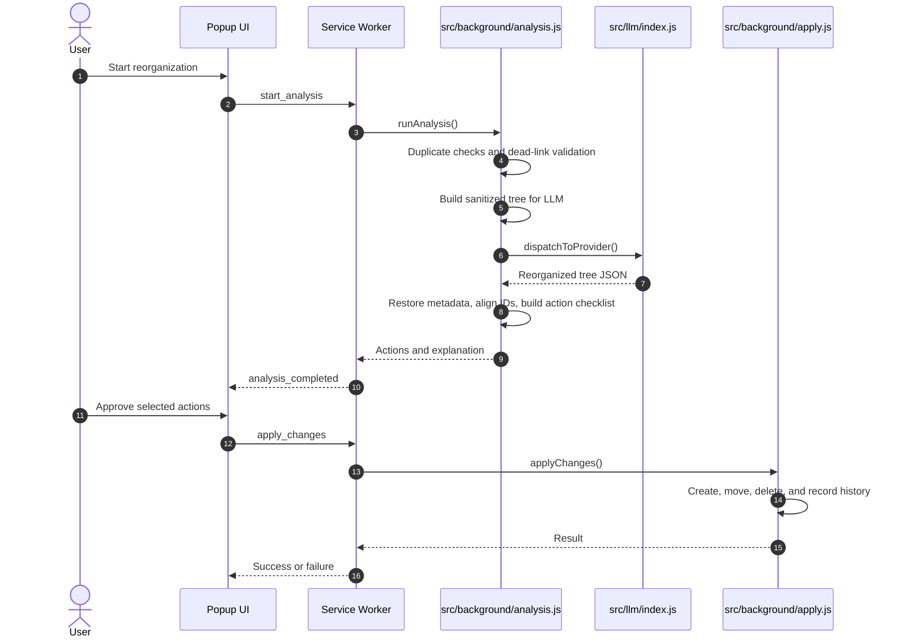

# AI Agent Guide

This file is the working guide for AI coding agents modifying FavorAI. Keep it practical: understand the extension boundaries, preserve user data safety, respect the LLM contracts, and run the right checks before handing work back.

## Fast Orientation

FavorAI is a Manifest V3 Chrome and Chromium extension for AI-assisted bookmark cleanup and reorganization.

Key entrypoints:

- `manifest.json`: extension permissions, CSP, service worker declaration, popup entrypoint
- `background.js`: service worker entrypoint
- `src/background/orchestrator.js`: message routing, status persistence, analysis/apply orchestration
- `src/background/analysis.js`: duplicate checks, dead link checks, LLM preparation, response alignment, diff generation
- `src/background/apply.js`: safe bookmark mutations and temporary folder ID resolution
- `src/background/history.js`: reorganization history and rollback
- `src/llm/index.js`: central LLM dispatch and prompt selection
- `src/llm/providers/`: provider clients for OpenAI, Gemini, Claude, Mistral, DeepSeek, Ollama, and custom OpenAI-compatible endpoints
- `src/popup/`: modular popup UI code
- `src/utils/`: shared utility helpers
- `tests/unit/`: Vitest unit tests with mocked Chrome APIs
- `tests/e2e/`: Playwright tests that load the extension in Chromium

## Project Structure

```text
favorai-chrome/
|-- manifest.json
|-- background.js
|-- popup.html
|-- popup-light.html
|-- popup.css
|-- popup.js
|-- popup-light.js
|-- Makefile
|-- scripts/
|   |-- make-help.mjs
|   |-- clean.mjs
|   |-- clean-e2e.mjs
|   |-- kill-e2e.mjs
|   |-- security-check.js
|   |-- package.js
|   |-- publish.mjs
|   |-- bump-version.js
|   |-- release.js
|   `-- get-refresh-token.mjs
|-- src/
|   |-- background/
|   |-- llm/
|   |-- popup/
|   `-- utils/
|-- tests/
|   |-- unit/
|   |-- e2e/
|   `-- mocks/
|-- store-assets/
|-- _locales/
|-- icons/
`-- fonts/
```

## Agent Operating Rules

- Preserve the separation of concerns: popup UI code stays in `src/popup/`, background orchestration stays in `src/background/`, provider-specific API logic stays in `src/llm/providers/`, and shared helpers stay in `src/utils/`.
- Do not move network calls for LLM providers into the popup. Popup requests can abort when the popup closes; background service worker calls are the intended path.
- Do not store long-lived workflow state only in service worker memory. MV3 service workers are ephemeral. Persist status, pending actions, popup window IDs, and history in `chrome.storage.local`.
- Use `chrome.storage.sync` only for user configuration such as provider, model, API key, prompt settings, and similar stable preferences.
- Avoid rapid or looped writes to `chrome.storage.sync`; it has strict quota limits.
- Never log API keys or secrets. Mask sensitive values in debug output.
- Do not introduce remote scripts, CDN dependencies, or dynamic script loading. Extension pages are governed by CSP and store review expectations.
- Avoid unsafe rendering with user-controlled values. Prefer DOM construction and `textContent`; use escaping helpers when HTML output is unavoidable.
- Keep bookmark mutation logic sequential and reversible. Preserve history entries when changes are applied.
- Do not silently fall back to root folders when a `new_` parent cannot be resolved. Skip the child operation and keep the failure explicit.
- Treat bookmark titles and URLs as untrusted input. They can be prompt-injection or XSS vectors.
- Keep user privacy visible: bookmark titles, URLs, and structure may be sent to the configured LLM provider, but not to FavorAI-owned servers.

## LLM Contracts

The LLM contract is part of the product's data integrity model. Do not loosen it casually.

### Simplified Input Tree

The tree sent to the LLM includes IDs, titles, folders, and URLs for semantic classification. Local duplicate and dead-link handling runs before this step.

```json
{
  "id": "1",
  "title": "Bookmarks Bar",
  "children": [
    { "id": "10", "title": "GitHub repository", "url": "https://github.com" },
    {
      "id": "2",
      "title": "Design resources",
      "children": [
        { "id": "11", "title": "CSS Gradients guide", "url": "https://css-tricks.com" }
      ]
    }
  ]
}
```

### Reorganized Output

The LLM response must be a JSON object with `reorganizedTree` and `explanation`.

```json
{
  "reorganizedTree": {
    "id": "1",
    "title": "Bookmarks Bar",
    "children": [
      {
        "id": "new_dev_tools",
        "title": "Developer Tools",
        "children": [
          { "id": "10" }
        ]
      }
    ]
  },
  "explanation": "Brief summary of the proposed changes."
}
```

Required rules:

- Existing bookmarks in LLM output should contain only `id`; titles and URLs are restored client-side through `restoreOriginalMetadata`.
- New folders must use IDs beginning with `new_`.
- Complete mode expects new top-level folders under the bookmarks bar. Original folder IDs may appear deeper only when intentionally preserved as subfolders.
- Keep prompt template replacement single-pass. Do not replace placeholders sequentially in a way that allows bookmark content to create new placeholders.
- When adding a provider, wire it through `dispatchToProvider()` and add focused unit tests for routing, request shape, error handling, and parsing.

## Bookmark Reorganization Flow



## Makefile Commands

Run `make` for the formatted command list.

### Setup

| Command | Use |
|---|---|
| `make install` | Install project dependencies |
| `make install-ci` | Install CI dependencies without lifecycle scripts |
| `make install-hooks` | Regenerate Husky hooks |
| `make install-codegraph` | Install and initialize local CodeGraph indexing |

### Quality

| Command | Use |
|---|---|
| `make lint` | Run ESLint checks |
| `make lint-fix` | Auto-fix lint issues |
| `make test` | Run Vitest unit tests |
| `make test-watch` | Run Vitest in watch mode |
| `make test-coverage` | Run coverage and print summary |
| `make test-mutation` | Run Stryker mutation testing |
| `make security` | Run npm audit, ESLint security, web-ext lint, and Gitleaks |
| `make check-deps` | Show outdated devDependencies |
| `make update-deps` | Upgrade devDependencies |

### E2E

| Command | Use |
|---|---|
| `make test-e2e` | Run all Playwright E2E tests |
| `make test-e2e-ui` | Run UI E2E tests only |
| `make test-e2e-integration` | Run integration E2E tests only |

### Release

| Command | Use |
|---|---|
| `make bump` | Auto-detect version bump and update changelog |
| `make bump-patch` | Manual patch release |
| `make bump-minor` | Manual minor release |
| `make bump-major` | Manual major release |
| `make release` | Package, push tags, and create or update GitHub release |
| `make package` | Build the extension ZIP |
| `make screenshots` | Generate Chrome Web Store PNG assets |
| `make upload` | Upload ZIP as a Chrome Web Store draft |
| `make publish` | Upload and publish to all users |
| `make publish-testers` | Upload and publish to trusted testers |

### Cleanup

| Command | Use |
|---|---|
| `make clean` | Remove build, test, mutation, generated asset outputs, and ZIPs |
| `make clean-e2e` | Remove Playwright reports and temporary directories |
| `make kill-e2e` | Kill stuck Playwright/Chrome processes |

## Testing Expectations

- Run `make lint && make test` for normal code changes.
- Run `make test-e2e` for popup, browser integration, storage workflow, or user-facing UI changes.
- Run `make security` for release-sensitive, dependency, provider, auth, URL handling, or DOM rendering changes.
- Unit tests must mock Chrome APIs through the test setup; never call real browser APIs from unit tests.
- Keep coverage at 100%. If V8 creates synthetic uncovered branches on top-level imports or JSDoc, use `/* v8 ignore next */` only immediately before the affected statement.
- Add or update unit tests when changing `src/background/`, `src/llm/`, or `src/utils/`.
- Add or update E2E tests when changing visible popup behavior or cross-module browser flows.

Chrome API mock example:

```javascript
chrome.bookmarks.getTree.mockResolvedValue([{ id: '0', title: 'Root', children: [] }]);
```

## Security Checklist for Agents

Before finishing security-relevant work, check:

- Are all external fetches performed from the background service worker?
- Are API keys and provider credentials masked in logs?
- Are bookmark titles and URLs treated as untrusted input?
- Are unsafe URL schemes rejected through `isSafeUrl()` where relevant?
- Is UI output rendered with DOM APIs, `textContent`, or `escapeHtml()`?
- Are prompt templates using single-pass replacement?
- Does bookmark apply logic avoid unresolved `new_` parent fallbacks?
- Are rollback/history records preserved for successful bookmark mutations?

## Manifest V3 Gotchas

- Service workers can be terminated after short idle periods. Persist state before assuming it will survive.
- Alarm-based keepalive behavior must remain lightweight.
- Extension CSP blocks remote scripts. Keep all runtime code local.
- Optional host permissions exist for link checks; do not broaden permissions without a clear product need.
- `chrome.storage.sync` is for stable settings, not progress logs or high-frequency updates.

## Git and Release Rules

- Use Conventional Commits, for example `feat: add provider preset`, `fix(ui): align history actions`, or `docs: update agent guide`.
- Do not commit secrets, `.env`, generated reports, coverage output, ZIPs, or local indexes.
- The release flow expects:

```bash
make lint && make test && make test-e2e && make security
make bump
make publish
```

- Chrome Web Store credentials live in `.env`, which is gitignored. Use `.env.example` as the template.
- `make screenshots` regenerates `store-assets/output/`; those PNG outputs are generated artifacts.

## CodeGraph Support

CodeGraph is optional local indexing for Codex and MCP-aware agents. It is not part of the extension runtime.

- Install and initialize it with `make install-codegraph`.
- The index lives in `.codegraph/` and is ignored by Git.
- If a structural code question is asked and CodeGraph is available, prefer it over broad manual file reads.

## Common Change Recipes

### Add or Update an LLM Provider

- Add or edit the provider module in `src/llm/providers/`.
- Wire the provider in `src/llm/index.js`.
- Preserve `AbortSignal` support and fetch timeout behavior.
- Mask API keys in debug logs.
- Add a focused unit test file at `tests/unit/<provider>Provider.test.js`. It must cover at minimum: 429 retry (one failure then success), 503 retry (one failure then success), and pre-aborted signal (no fetch call made). Use `vi.useFakeTimers()` and advance timers past the retry delay. Follow the pattern in `tests/unit/openaiProvider.test.js`.
- Run `make lint && make test`.

### Change Reorganization Logic

- Start in `src/background/analysis.js`, `src/background/diff.js`, and `src/background/apply.js`.
- Keep the `new_` folder contract intact.
- Preserve metadata restoration through `restoreOriginalMetadata`.
- Keep action generation deterministic enough for tests.
- `applyChanges()` returns `{ failures }` — an array of `{ type, title, error }` objects for operations that threw. The orchestrator forwards this to the popup, which shows per-operation error details. Do not swallow errors silently in `apply.js` catch blocks; push to `failures` instead.
- Update unit tests for diff/apply/history behavior.
- Run `make lint && make test`.

### Change Popup UI

- Edit `popup.html`, `popup-light.html`, `popup.css`, `popup.js`, `popup-light.js`, or modules in `src/popup/`.
- Keep user-facing text localizable through `_locales/`.
- Use safe DOM rendering patterns.
- Update E2E tests when behavior or layout changes.
- Run `make lint && make test && make test-e2e`.

### Change Packaging or Release Tooling

- Edit `scripts/package.js`, `scripts/publish.mjs`, `scripts/release.js`, or `scripts/bump-version.js`.
- Keep Windows and Linux compatibility in mind.
- Avoid shell-specific behavior when Node APIs are reasonable.
- Test the specific Makefile command when possible.

## Final Handoff Checklist

Before handing work back, report:

- What changed and why.
- Which files were touched.
- Which commands were run.
- Any commands that were skipped and why.
- Any residual risk or follow-up that matters.
