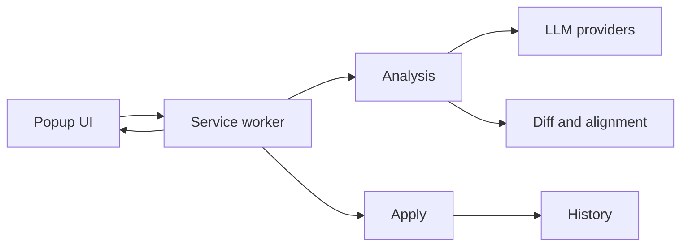

# Architecture

## Stack

- JavaScript, Manifest V3, and Chrome extension APIs. The app is a local browser extension, so the service worker and popup stay separate.
- Vitest for unit tests and Playwright for browser-level checks.

## How it fits together

## Key decisions

- Background code owns provider fetches and bookmark mutations. The popup only requests work.
- Existing bookmark metadata is restored client-side after the LLM returns IDs-only nodes.
- New folders use `new_` IDs and unresolved parents must not silently fall back to root.
- User-facing configuration lives in `chrome.storage.sync`; workflow state and history live in `chrome.storage.local`.

## Gotchas

- MV3 service workers are ephemeral. Never rely on in-memory state alone.
- Bookmark titles and URLs are untrusted input.
- The extension CSP forbids remote scripts, so runtime code stays local.

