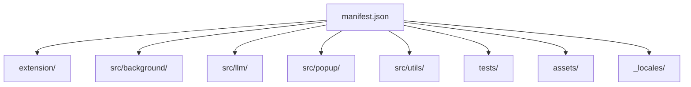

# Codebase Map

## Areas

- `extension/`: popup HTML and the service worker entrypoint.
- `src/background/`: orchestration, analysis, diffing, apply, history, and status.
- `src/llm/`: provider dispatch, prompts, and provider clients.
- `src/popup/`: popup UI behavior, tabs, config, history, and result rendering.
- `src/utils/`: shared helpers used across the extension.
- `tests/`: Vitest unit tests and Playwright E2E tests.
- `assets/`: icons, fonts, and generated UI assets.
- `_locales/`: localized UI strings.

## Entry points

- `manifest.json`
- `extension/background.js`
- `extension/popup-light.html`
- `extension/popup.html`

