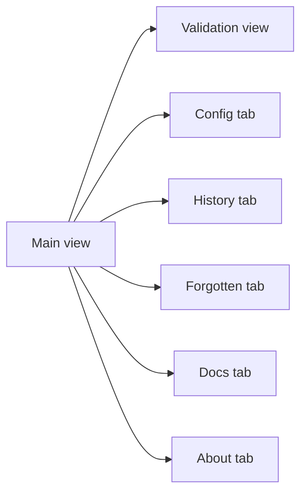

# Navigation

## Routing

- There is no client router. The popup switches between panels by toggling classes in `src/popup/navigation.js`.
- The popup remembers the active tab in `chrome.storage.local`.

## Structure

