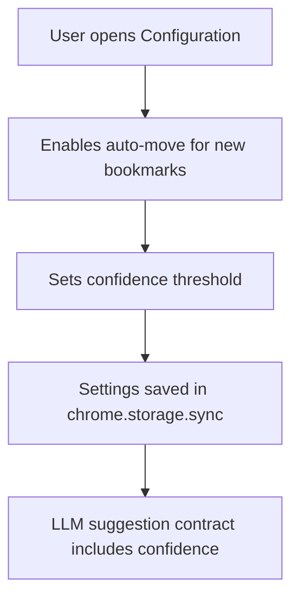

# Instruction: Contract & settings

## Architecture projection

> Tree of the final files. ✅ create · ✏️ modify · ❌ delete

```txt
.
├── ✏️ src/llm/prompts.js
├── ✏️ src/llm/utils.js
├── ✏️ src/llm/index.js
├── ✏️ src/popup/config.js
├── ✏️ extension/popup.html
├── ✏️ extension/popup-light.html
├── ✏️ _locales/*
└── ✏️ tests/unit/*
```

## User Journey



## Tasks to do

### `1)` Extend the suggestion contract

> Make the LLM response carry a numeric confidence score that can drive the auto-move decision.

1. Update the suggestion prompt/schema to request confidence on a normalized scale.
2. Accept and validate the new field in the suggestion response parser.
3. Keep existing required fields backward-compatible.

### `2)` Persist the user controls

> Add stable config values for enabling auto-move and tuning the threshold.

1. Load/save the new settings through the existing config flow.
2. Add default values that survive reset/import/export paths.
3. Add the UI controls in configuration copy and localization strings.

## Test acceptance criteria

| Task | Acceptance criteria |
| ---- | ------------------- |
| 1 | A valid suggestion response can include confidence without breaking existing responses. |
| 2 | The new settings load, save, reset, and export/import consistently with the rest of the config. |
