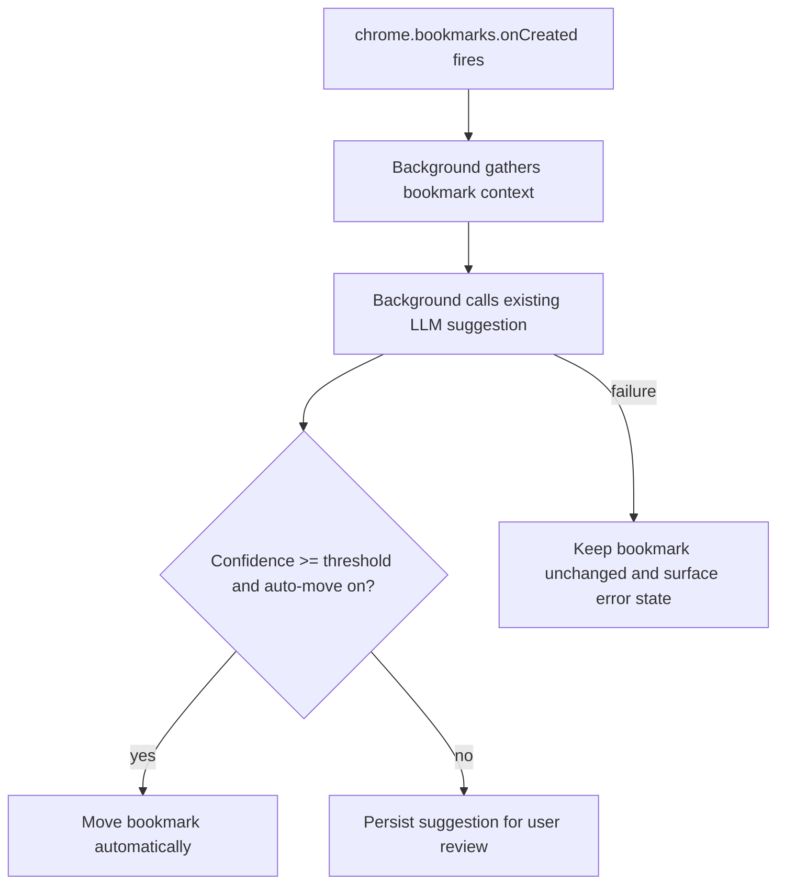

# Instruction: Background lifecycle

## Architecture projection

> Tree of the final files. ✅ create · ✏️ modify · ❌ delete

```txt
.
├── ✏️ src/background/orchestrator.js
├── ✏️ src/background/* (new helper if needed)
├── ✏️ src/background/config.js
├── ✏️ src/background/runtime-messaging.js
└── ✏️ tests/unit/*
```

## User Journey



## Tasks to do

### `1)` Register the creation hook

> Detect manual bookmark creation and kick off classification from the service worker.

1. Add the listener in the background entry path without moving provider logic into the popup.
2. Filter out cases that should not trigger auto-classification if the product needs a guardrail.
3. Keep the workflow state in storage, not in service-worker memory only.

### `2)` Decide auto-move vs deferred suggestion

> Use the LLM result plus the user threshold to decide whether to move immediately.

1. Reuse the existing folder suggestion call and folder lookup logic.
2. Compare confidence to the configured threshold before mutating bookmarks.
3. Store the suggestion and error state so the popup can explain what happened.

## Test acceptance criteria

| Task | Acceptance criteria |
| ---- | ------------------- |
| 1 | A new bookmark creation triggers exactly one suggestion flow from the background. |
| 2 | Auto-move happens only when the setting is enabled and the returned confidence passes the threshold. |
| 3 | On LLM failure, the bookmark stays where it is and an explicit error state is recorded. |
