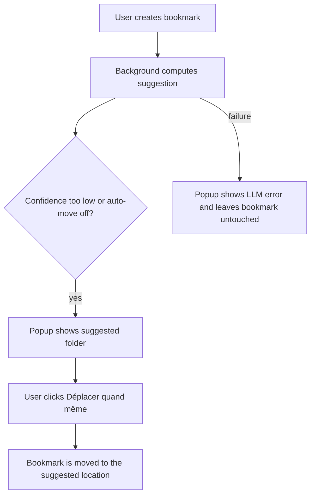

# Instruction: Popup fallback UX

## Architecture projection

> Tree of the final files. ✅ create · ✏️ modify · ❌ delete

```txt
.
├── ✏️ extension/popup-light.html
├── ✏️ extension/popup-light.js
├── ✏️ src/popup/utils.js
├── ✏️ src/popup/*
└── ✏️ _locales/*
```

## User Journey



## Tasks to do

### `1)` Show the fallback state

> Surface the suggestion and the reason the bookmark was not moved yet.

1. Add a popup state for a pending auto-classification result.
2. Display the suggested folder, confidence, and any error message clearly.
3. Keep rendering safe and consistent with the current popup-light style.

### `2)` Add the override action

> Let the user apply the suggestion even when auto-move did not happen.

1. Add a `Déplacer quand même` action that moves the existing bookmark, not a new bookmark.
2. Reuse the background apply path so the mutation stays sequential and reversible.
3. Leave the bookmark untouched if the user dismisses the popup.

## Test acceptance criteria

| Task | Acceptance criteria |
| ---- | ------------------- |
| 1 | The popup can show a low-confidence suggestion without mutating the bookmark automatically. |
| 2 | Clicking `Déplacer quand même` performs the move to the suggested destination. |
| 3 | A background LLM error is visible to the user and does not trigger a move. |
