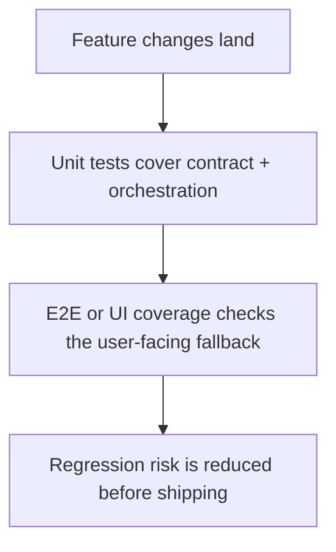

# Instruction: Tests & regression coverage

## Architecture projection

> Tree of the final files. ✅ create · ✏️ modify · ❌ delete

```txt
.
├── ✏️ tests/unit/llmValidation.test.js
├── ✏️ tests/unit/llmIndex.test.js
├── ✏️ tests/unit/config.test.js
├── ✏️ tests/unit/*
└── ✏️ tests/e2e/*
```

## User Journey



## Tasks to do

### `1)` Add contract and settings coverage

> Protect the new fields and persistence behavior.

1. Cover the confidence field in suggestion validation tests.
2. Cover config load/save/reset/import/export for the new auto-move settings.

### `2)` Add background and popup coverage

> Prove the new lifecycle behaves correctly.

1. Cover the onCreated branch and threshold decision logic.
2. Add popup-path coverage for the fallback UI and override action.

## Test acceptance criteria

| Task | Acceptance criteria |
| ---- | ------------------- |
| 1 | The suggestion parser accepts confidence and rejects malformed values. |
| 2 | The config layer persists the new user controls with the expected defaults. |
| 3 | The background and popup behaviors are covered for success, fallback, and error paths. |
