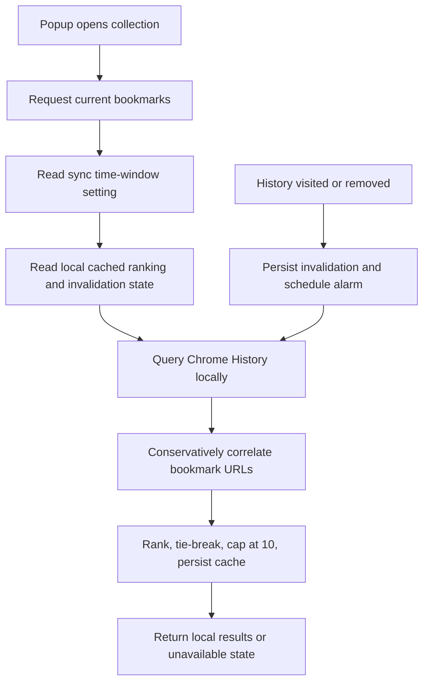

# Instruction: Local ranking and MV3-safe refresh

## Architecture projection

```txt
.
├── manifest.json ✏️ (verify existing history permission)
├── src/background/most-used.js ✅
├── src/background/orchestrator.js ✏️
├── src/utils/historyUrlKey.js ✅
└── tests/unit/mostUsedBookmarks.test.js ✅
```

## User Journey



## Tasks to do

### `1)` Define ranking contract

> Produce deterministic, local ranking data without changing bookmarks.

1. Flatten URL bookmarks and exclude unsafe or unsupported schemes.
2. Build a dedicated history-match key that preserves scheme, path, and query identity; normalize only syntax Chrome treats equivalently and never reuse `normalizeUrlForDuplicate()`.
3. Query recent history locally for the selected window, match only candidate bookmarked URLs, and retrieve exact visit details only when needed for in-window counts.
4. Bound concurrent history reads and document the refresh budget for large bookmark libraries.
5. Sort by visit count descending, latest visit descending, then history-match key and bookmark ID deterministically.
6. Return at most ten records containing bookmark ID, title, original URL, visit count, and last visit date.

### `2)` Add background message and refresh lifecycle

> Make ranking available when the managed Chrome folder refreshes and after visit bursts.

1. Add a background message for fetching the collection and updating the time window.
2. Persist the selected window in `chrome.storage.sync`; persist only derived cache, invalidation state, and alarm scheduling state in `chrome.storage.local`; never send it through LLM paths.
3. Register `chrome.history.onVisited`, `chrome.history.onVisitRemoved`, and `chrome.alarms.onAlarm` at service-worker startup.
4. On relevant history events, persist invalidation and schedule one named debounce alarm; an opened collection refreshes immediately when invalidated.
5. Handle absent, policy-disabled, or failing History APIs with an explicit `history_unavailable` state without blocking the rest of the popup.

## Test acceptance criteria

| Task | Acceptance criteria |
| ---- | ------------------- |
| 1 | Matching preserves distinct protocol/query URLs, excludes unsafe schemes, respects the time window, remains bounded for large libraries, returns no more than ten items, and applies deterministic tie-breaking. |
| 2 | Opening an invalidated collection refreshes ranking; bursts of history changes result in one persisted, alarm-driven refresh; history removal invalidates results; unavailable history returns an explicit fallback state and never mutates bookmarks. |
