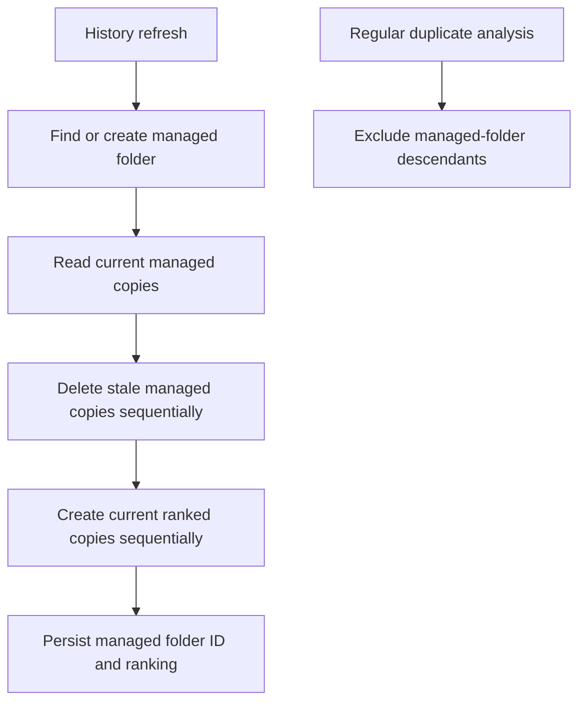

# Instruction: Managed-folder lifecycle and duplicate exemption

## Architecture projection

```txt
.
├── src/background/most-used.js ✏️
├── src/background/analysis.js ✏️
├── src/background/diff.js ✏️ (only if duplicate filtering needs a shared helper)
└── tests/unit/mostUsedBookmarks.test.js ✏️
```

## User Journey



## Tasks to do

### `1)` Reconcile the managed folder

> Keep a single system-owned folder aligned with the current ranking without moving originals.

1. Locate the persisted managed folder ID and verify its parent is the bookmarks bar; otherwise create a new folder under the bookmarks bar.
2. Remove only the folder's existing child bookmarks, then create copies of the current top-ten ranking sequentially.
3. Never move, rename, or delete an original bookmark; leave the managed folder empty when history is unavailable or ranking is empty.
4. Persist the managed-folder ID locally and expose its path to the popup.

### `2)` Preserve the duplicate exception boundary

> Ensure only managed-folder copies are exempt from duplicate cleanup.

1. Filter managed-folder descendants before duplicate detection and duplicate deletion logic.
2. Keep normal duplicate detection unchanged for every other folder.
3. Ensure reorganization never deletes the managed folder as an empty folder or moves its children.

## Test acceptance criteria

| Task | Acceptance criteria |
| ---- | ------------------- |
| 1 | Exactly one managed folder is created under the bookmarks bar, contains at most ten copied bookmarks, and never changes an original bookmark. |
| 2 | Duplicate handling continues everywhere except the managed folder, whose entries are neither flagged nor deleted. |
