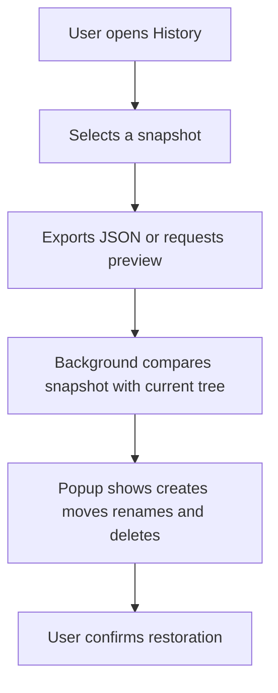

# Instruction: Export, diff et prévisualisation

## Architecture projection

> Tree of the final files. ✅ create · 🛠️ modify · ❌ delete

```txt
.
├── src/background/snapshots.js 🛠️
├── src/background/orchestrator.js 🛠️
├── src/popup/history.js 🛠️
├── extension/popup.html 🛠️
├── _locales/en/messages.json 🛠️
├── _locales/fr/messages.json 🛠️
└── tests/e2e/integration/bookmark-snapshots.spec.js ✅
```

## User Journey



## Tasks to do

### `1)` Exporter le snapshot

> Permettre à l’utilisateur de télécharger une copie locale lisible et réutilisable.

1. Ajouter une action d’export depuis la liste des snapshots.
2. Télécharger un JSON versionné contenant uniquement le modèle de snapshot.
3. Afficher un succès ou une erreur sans exposer de données sensibles dans les logs ou l’interface.

### `2)` Construire le diff

> Rendre les conséquences d’une restauration visibles avant toute mutation.

1. Comparer l’arbre courant au snapshot par chemin, type, titre et URL, avec remappage des IDs quand nécessaire.
2. Produire des opérations déterministes de création, déplacement, renommage et suppression.
3. Afficher le nombre et le détail des opérations, y compris les éléments qui ne pourront pas être restaurés automatiquement.

### `3)` Ajouter la confirmation

> Empêcher une restauration destructive involontaire.

1. Exiger une confirmation explicite après affichage du diff.
2. Désactiver l’action pendant le calcul et la restauration.
3. Prévoir des textes localisés en anglais et en français.

## Test acceptance criteria

| Task | Acceptance criteria |
| ---- | ------------------- |
| 1 | Cliquer sur Export télécharge un JSON valide qui ne contient aucune clé API, provider, modèle ou prompt. |
| 2 | Pour un arbre modifié, la prévisualisation liste les changements attendus sans appeler de mutation Chrome. |
| 3 | Annuler la confirmation ne change aucun favori ; le diff et les erreurs restent compréhensibles dans les deux langues. |
