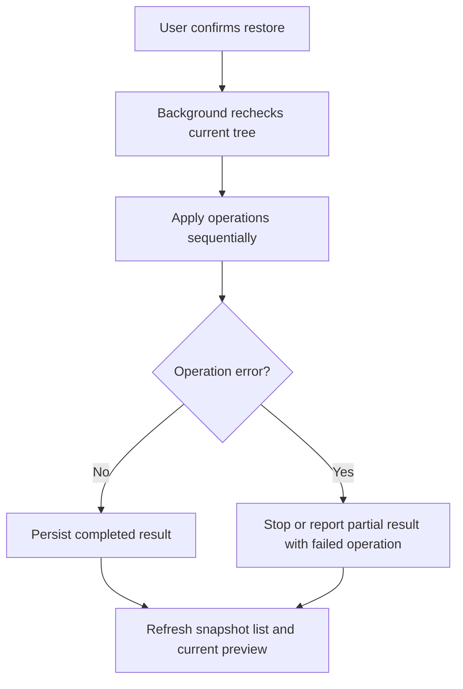

# Instruction: Restauration séquentielle et couverture de tests

## Architecture projection

> Tree of the final files. ✅ create · 🛠️ modify · ❌ delete

```txt
.
├── src/background/snapshots.js 🛠️
├── src/background/apply.js 🛠️
├── src/background/history.js 🛠️
├── src/background/orchestrator.js 🛠️
├── src/popup/history.js 🛠️
├── tests/unit/snapshots.test.js 🛠️
├── tests/unit/history.test.js 🛠️
├── tests/unit/apply.test.js 🛠️
└── tests/e2e/integration/bookmark-snapshots.spec.js 🛠️
```

## User Journey



## Tasks to do

### `1)` Restaurer de façon séquentielle

> Reproduire l’état du snapshot sans supposer que les IDs historiques sont encore valides.

1. Revalider l’arbre courant avant mutation et refuser une restauration devenue obsolète si nécessaire.
2. Créer les dossiers parents avant leurs enfants, déplacer et renommer les nœuds existants, puis supprimer les nœuds en dernier.
3. Remapper les IDs créés pendant la restauration et ne jamais retomber silencieusement sur la racine.
4. Enregistrer les opérations réalisées dans l’historique et conserver les échecs détaillés.

### `2)` Gérer les erreurs et la reprise

> L’utilisateur doit savoir ce qui a réussi et ce qui reste à traiter.

1. Retourner le nombre de succès, d’échecs et les titres/types concernés.
2. Laisser le snapshot intact après une restauration partielle.
3. Permettre une nouvelle prévisualisation après échec sans masquer les changements déjà réalisés.

### `3)` Tester le comportement observable

> Couvrir le contrat de données, la sécurité de l’application et le parcours utilisateur.

1. Ajouter des tests unitaires pour sérialisation, rétention, export payload, diff, remappage d’IDs et ordre séquentiel.
2. Étendre `history.test.js` et `apply.test.js` pour capture préalable, restauration complète, refus de cohérence et erreurs partielles.
3. Ajouter un E2E couvrant capture avant apply, affichage du diff, annulation, confirmation, téléchargement et restauration avec erreur.

## Test acceptance criteria

| Task | Acceptance criteria |
| ---- | ------------------- |
| 1 | Une restauration confirmée recrée l’arbre dans l’ordre parent-enfant, remappe les IDs recréés et n’effectue aucune mutation après une incohérence détectée. |
| 2 | Une erreur Chrome est rapportée avec l’opération concernée ; les succès restent visibles et le snapshot original reste disponible. |
| 3 | Les tests unitaires et E2E vérifient les parcours succès, annulation, arbre obsolète, export sans secrets et restauration partielle. |
