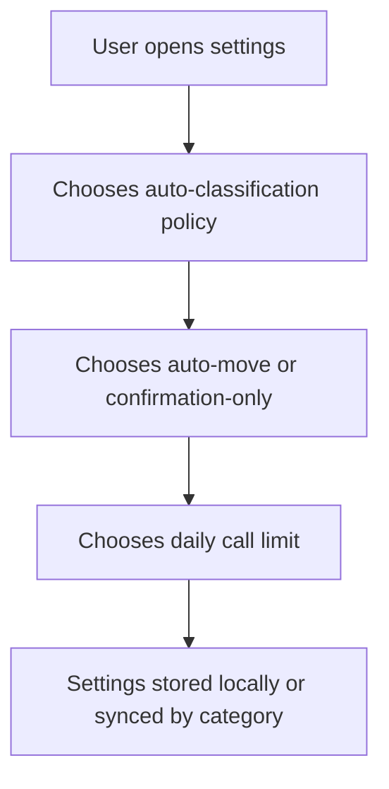

# Instruction: Contrat, réglages et état de classification automatique

## Architecture projection

> Tree of the final files. ✅ create · ✏️ modify · ❌ delete

```txt
.
├── src/background/auto-bookmark-policy.js ✅
├── src/background/orchestrator.js ✏️
├── src/utils/constants.js ✏️
├── src/popup/config.js ✏️
├── extension/popup.html ✏️
├── _locales/en/messages.json ✏️
├── _locales/fr/messages.json ✏️
└── tests/unit/autoBookmarkPolicy.test.js ✅
```

## User Journey



## Tasks to do

### `1)` Define normalized policy

> Make every classification decision derive from one explicit, testable policy.

1. Define confirmation-only mode, auto-move mode, daily call limit, debounce window, burst threshold, and retention values.
2. Normalize invalid or missing settings to safe defaults.
3. Keep stable preferences in `chrome.storage.sync` and counters, queue items, and transient states in `chrome.storage.local`.

### `2)` Define persisted queue item contract

> Make queued work recoverable and safe across service-worker restarts.

1. Store bookmark ID, creation snapshot, enqueue time, event-burst key, status, attempt count, and cancellation marker.
2. Store suggestion state separately from policy and usage counters.
3. Expose a pure decision function for origin confidence, budget eligibility, and auto-move eligibility.

### `3)` Wire settings and localization

> Give users a visible way to control automatic mutations and cost.

1. Add localized labels and help text for policy, daily limit, and uncertain-origin behavior.
2. Preserve existing defaults and import/export compatibility.
3. Do not trigger an LLM call or bookmark mutation when settings change.

## Test acceptance criteria

| Task | Acceptance criteria |
| ---- | ------------------- |
| 1 | Invalid policy values normalize to safe defaults, and a disabled or confirmation-only policy never authorizes automatic mutation. |
| 2 | A queue item can be serialized and restored without losing its bookmark snapshot, status, or cancellation state. |
| 3 | Settings appear in English and French, remain backward-compatible, and changing them performs no network or bookmark operation. |
