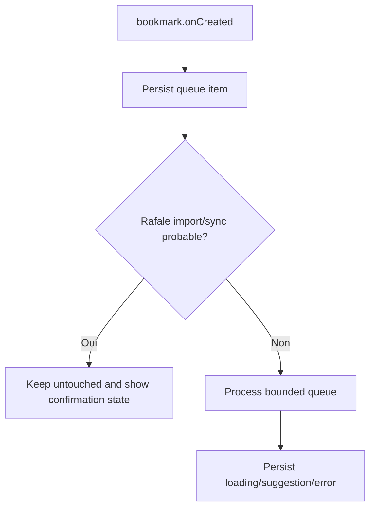

# Instruction: File background et détection des rafales

## Architecture projection

> Tree of the final files. ✅ create · ✏️ modify · ❌ delete

```txt
.
├── src/background/auto-bookmark-queue.js ✅
├── src/background/orchestrator.js ✏️
├── src/background/status.js ✏️
└── tests/unit/autoBookmarkQueue.test.js ✅
```

## User Journey



## Tasks to do

### `1)` Replace direct processing with a bounded queue

> Ensure one controlled worker handles new-bookmark events.

1. Make `onCreated` validate URL bookmarks, ignore system-managed copies, and enqueue instead of calling the LLM directly.
2. Process at most one suggestion at a time, with debounce and cancellation between items.
3. Recover queued items after service-worker restart without duplicating active work.

### `2)` Add conservative burst heuristics

> Avoid classifying likely imports and synchronizations as manual creations.

1. Group nearby creation events by time and parent/context.
2. Mark uncertain-origin items as untouched and expose the reason in local state.
3. Ensure internal suppression guards do not consume unrelated external events.

### `3)` Enforce daily call limits

> Bound provider cost without losing recoverable user state.

1. Track calls by local calendar day and configured limit.
2. Stop before dispatch when the limit is reached.
3. Persist a visible rate-limit state and allow the next day or explicit retry to resume.

## Test acceptance criteria

| Task | Acceptance criteria |
| ---- | ------------------- |
| 1 | Sequential events are processed in order, a service-worker restart resumes pending work, and no bookmark is classified twice. |
| 2 | A burst is left untouched, while a single likely-manual event remains eligible; suppression only covers the intended internal mutation. |
| 3 | No LLM call occurs after the daily limit, the remaining items stay recoverable, and the UI receives a localized limit state. |
