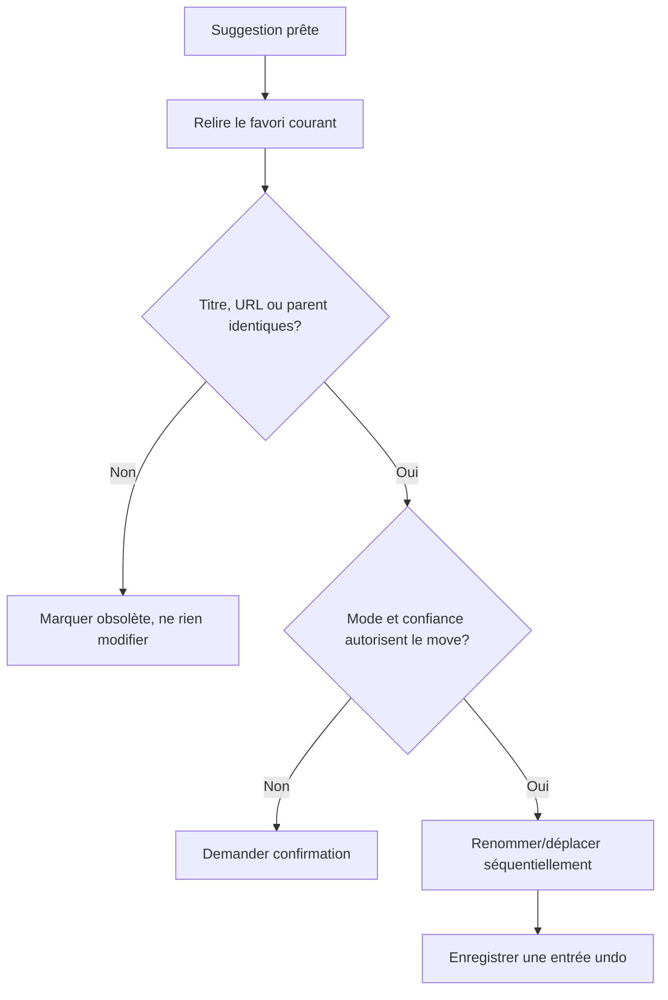

# Instruction: Revalidation, cancellation et mutations sûres

## Architecture projection

> Tree of the final files. ✅ create · ✏️ modify · ❌ delete

```txt
.
├── src/background/auto-bookmark-queue.js ✏️
├── src/background/orchestrator.js ✏️
├── src/background/history.js ✏️
├── src/utils/tree-fingerprint.js ✏️
└── tests/unit/autoclassify.test.js ✏️
```

## User Journey



## Tasks to do

### `1)` Revalidate before applying

> Prevent stale suggestions from overwriting a newer bookmark state.

1. Fetch the current bookmark immediately before applying a pending or automatic suggestion.
2. Compare ID, URL, title, parent, and expected snapshot/fingerprint.
3. Leave the bookmark untouched and persist a stale state when any protected field changed.

### `2)` Add cancellation semantics

> Stop queued or in-flight work without applying a late result.

1. Use an `AbortController` per queue item and persist cancellation intent.
2. Ignore late provider responses after cancellation.
3. Keep canceled items visible long enough for the user to understand why no move occurred.

### `3)` Preserve reversible automatic mutations

> Make every automatic move or rename undoable through existing history.

1. Reuse sequential apply behavior and add an explicit automatic-operation marker to history.
2. Expose one-item undo without removing unrelated history entries.
3. Roll back a partial rename/move failure and report failures explicitly.

## Test acceptance criteria

| Task | Acceptance criteria |
| ---- | ------------------- |
| 1 | A changed title, URL, or parent prevents application and produces a stale state with zero mutation calls. |
| 2 | Cancellation stops queued work and a late LLM response cannot move or rename the bookmark. |
| 3 | A successful automatic change is undone by the existing rollback path, including rename-plus-move and partial-failure cases. |
