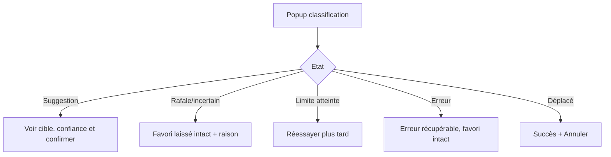

# Instruction: UX de confirmation, erreurs et undo

## Architecture projection

> Tree of the final files. ✅ create · ✏️ modify · ❌ delete

```txt
.
├── extension/popup-light.html ✏️
├── extension/popup-light.js ✏️
├── extension/popup.css ✏️
├── src/popup/history.js ✏️
├── _locales/en/messages.json ✏️
├── _locales/fr/messages.json ✏️
└── tests/e2e/ui/popup-light.spec.js ✏️
```

## User Journey



## Wireframe

```txt
+--------------------------------------+
| FavorAI — Nouveau favori             |
|--------------------------------------|
| Etat: Suggestion / Incertain / Erreur|
| Titre [____________________________]  |
| Dossier cible [____________________]  |
| Confiance: 87%   Seuil: 80%           |
|                                      |
| [Déplacer vers ce dossier] [Annuler] |
|                                      |
| Raison: ...                           |
|                                      |
| Limite: 3/20 appels aujourd’hui      |
+--------------------------------------+
```

## Tasks to do

### `1)` Render all persisted states

> Make uncertain, stale, canceled, rate-limited, loading, error, suggestion, and moved states understandable.

1. Keep the popup usable after it loses focus or reopens.
2. Never present an uncertain or stale item as already moved.
3. Explain that the bookmark remains untouched whenever automatic work is skipped.

### `2)` Add explicit confirmation-only and undo actions

> Give the user control over every ambiguous mutation.

1. Add a confirmation-only presentation for high-confidence suggestions.
2. Add a one-click undo after an automatic move or rename.
3. Keep undo tied to the exact history entry and report partial rollback failures.

### `3)` Localize and preserve accessibility

> Keep the safety UX consistent in English and French.

1. Add localized labels, explanations, errors, and accessible names.
2. Ensure keyboard focus and disabled states are correct while applying or undoing.
3. Do not render bookmark titles, URLs, or provider explanations as unsafe HTML.

## Test acceptance criteria

| Task | Acceptance criteria |
| ---- | ------------------- |
| 1 | Every persisted state has a distinct visible rendering and skipped work clearly says the bookmark was not modified. |
| 2 | A user can confirm an eligible suggestion or undo a completed automatic mutation without reopening the advanced popup. |
| 3 | English and French labels exist, dynamic values use safe DOM APIs, and keyboard users can reach all actions. |
