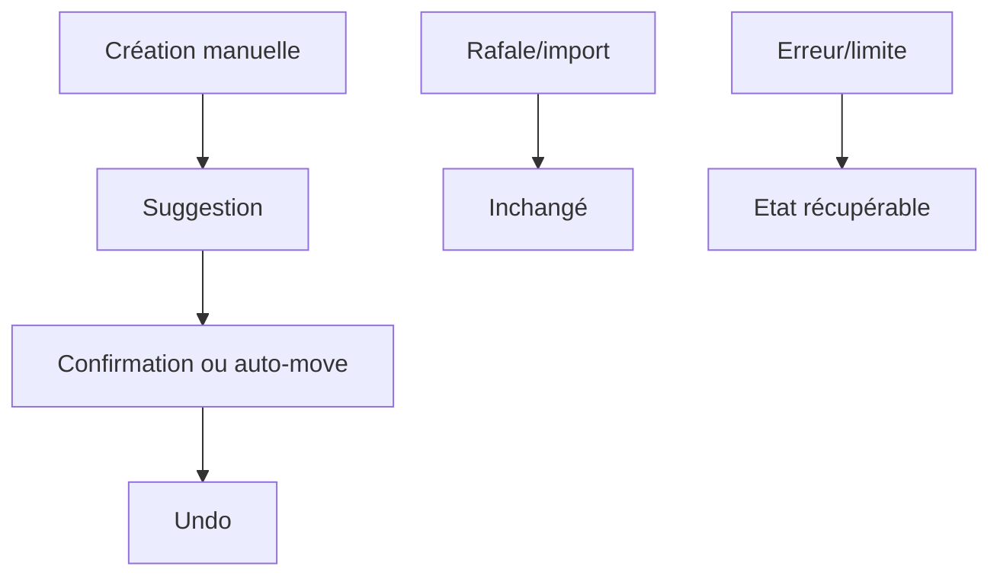

# Instruction: Tests unitaires et E2E de la classification durcie

## Architecture projection

> Tree of the final files. ✅ create · ✏️ modify · ❌ delete

```txt
.
├── tests/unit/autoBookmarkPolicy.test.js ✏️
├── tests/unit/autoBookmarkQueue.test.js ✏️
├── tests/unit/autoclassify.test.js ✏️
├── tests/unit/history.test.js ✏️
├── tests/e2e/integration/most-used-bookmarks.spec.js ✏️
└── tests/e2e/ui/popup-light.spec.js ✏️
```

## User Journey



## Tasks to do

### `1)` Cover policy and queue behavior

> Prove the background decisions independently from Chrome UI.

1. Test defaults, normalization, daily budget, queue ordering, debounce, cancellation, restart recovery, and burst classification.
2. Assert no provider call occurs for uncertain-origin or budget-blocked items.

### `2)` Cover stale and reversible mutations

> Prove that no stale suggestion can mutate the user's current bookmark.

1. Test changed title, URL, parent, deleted bookmark, duplicate event, and late response cases.
2. Test history creation, one-item undo, rename-plus-move rollback, and partial failures.

### `3)` Cover the user journey end to end

> Validate visible behavior rather than only storage internals.

1. Add E2E coverage for successful apply, persisted LLM error, uncertain-origin state, rate-limit state, cancellation, and undo.
2. Preserve existing popup-light and integration scenarios.
3. Run lint, unit tests, and the relevant E2E suites before marking the plan implemented.

## Test acceptance criteria

| Task | Acceptance criteria |
| ---- | ------------------- |
| 1 | Unit tests deterministically prove bounded queueing, burst protection, cancellation, restart recovery, and call limits. |
| 2 | Unit tests prove stale items remain untouched and every automatic mutation has a rollback path. |
| 3 | E2E tests observe the complete success/error/skip/undo journey, with the existing suite still passing. |
